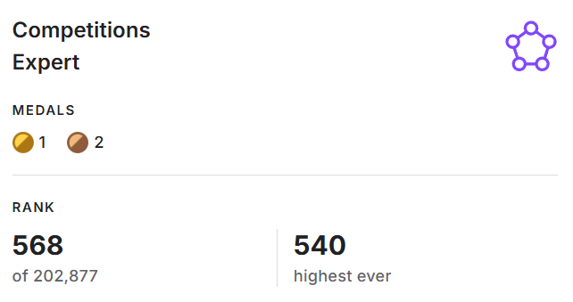

# Hi there, I'm Forrest-xlz 👋

## About Me
- An undergraduate student from China.
- Interested in AI, computer science, Kaggle, and language learning.
- Want to be GM in kaggle someday.

## What I'm Working On
- Kaggle competitions
- Machine learning projects
- C++ / Python coding practice
- English and Japanese learning

## Tech Stack
- Python
- C++
- Java
- PyTorch
- scikit-learn
- Git / GitHub

## 🏆 Awards
 - [Kaggle Profile](https://www.kaggle.com/forrestxlz)

- 🏅 2026 Kaggle CSIRO - Image2Biomass Prediction 13/3108 SOLO金牌
- 🥉 2026 Kaggle Santa 2025 - Christmas Tree Packing Challenge 243/3357 铜牌
- 🥉 2025 Kaggle Jigsaw - Agile Community Rules Classification 195/2445 SOLO铜牌
- 🏆 2025腾讯开悟人工智能全球公开赛【智能体算法决策-中级赛道】初赛冠军（强化学习）
- 🏅 2025腾讯开悟人工智能全球公开赛【智能体算法决策-中级赛道】复赛第13（强化学习）

- [Project 1](https://github.com/yourname/project1) - A machine learning project.
- [Project 2](https://github.com/yourname/project2) - A Kaggle competition solution.
- [Project 3](https://github.com/yourname/project3) - Algorithm practice in C++.

## Contact
- Email: xlz1014361885@gmail.com
- WeChat: 19959330731
